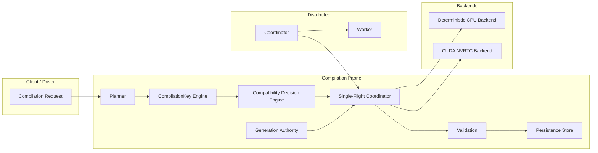

# Compilation Fabric

Compilation Fabric is an open-source, vendor-neutral runtime for orchestrating AI
compilation, specialization, code generation, artifact production, validation,
reproducibility, caching, invalidation, and accelerator-targeted deployment across
heterogeneous infrastructure.

## Governing system question

> How should executable AI artifacts be derived, specialized, validated,
> reproduced, invalidated, and deployed across heterogeneous accelerators so that
> compilation becomes a governed infrastructure process rather than scattered
> backend-specific build logic?

Compilation Fabric is not a compiler frontend, a generic build system, a kernel
cache, a graph cache, a make/ninja wrapper, a toy JIT, an MLIR demo, an autotuner
shell, a metadata index, or a command-runner abstraction. It is the runtime
boundary for compilation orchestration inside AI infrastructure.

## What it governs

- Compilation requests, plans, and attempts
- Toolchain and target selection
- Canonical, typed **CompilationKey** identity
- Compatibility decisions (a correctness decision, never a silent optimization)
- Guarded compilation lifecycle
- Specialization (shape, datatype, layout, quantization, precision, constants,
  launch configuration, architecture, feature flags, model/operator revision)
- Bounded autotuning / variant selection
- Reproducibility modes (Strict, BestEffort, Unspecified)
- Artifact validation (content digest, format, architecture, ABI, dependency,
  metadata, loadability, execution smoke, deterministic reference comparison)
- Invalidation and supersession under generation authority
- Versioned persistence and crash recovery
- Deployment/load eligibility and active-use leases
- Single-flight concurrent deduplication
- Distributed framed-TCP coordinator / worker orchestration

## Architecture



## Build

Requires CMake, Ninja, and MSVC (Visual Studio 2022 / current). Compilation Fabric
uses C++20 and builds clean with `/W4 /WX /permissive- /Zc:__cplusplus /utf-8`.
CUDA is reached through runtime-loaded NVRTC and the CUDA driver, so the library
builds and runs without a CUDA toolkit; CPU-only orchestration remains valid where
CUDA is unavailable.

```bat
:: from a developer command prompt
cmake -G Ninja -B build -DCMAKE_BUILD_TYPE=Release
cmake --build build
ctest --test-dir build
```

## Install / find_package

```bat
cmake --install build --prefix C:/path/to/prefix
```

An independent downstream project can then use:

```cmake
find_package(CompilationFabric CONFIG REQUIRED)
target_link_libraries(my_app PRIVATE CompilationFabric::CompilationFabric)
```

## CLI

```bat
build\tools\compile_fabric.exe compile request.json
build\tools\compile_fabric.exe toolchains
build\tools\compile_fabric.exe targets
build\tools\compile_fabric.exe stats
build\tools\compile_fabric.exe serve 4000
build\tools\compile_fabric.exe worker localhost 4000
```

## Documentation

- [architecture](docs/architecture.md)
- [lifecycle](docs/lifecycle.md)
- [compilation-key](docs/compilation-key.md)
- [toolchains](docs/toolchains.md)
- [planning](docs/planning.md)
- [specialization](docs/specialization.md)
- [autotuning](docs/autotuning.md)
- [reproducibility](docs/reproducibility.md)
- [validation](docs/validation.md)
- [artifacts](docs/artifacts.md)
- [persistence](docs/persistence.md)
- [recovery](docs/recovery.md)
- [protocol](docs/protocol.md)
- [validation-matrix](docs/validation-matrix.md)
- [benchmarks](docs/benchmarks.md)
- [limitations](docs/limitations.md)

## License

Apache License 2.0. Copyright 2026 Summon Software Labs. No telemetry transmission.
